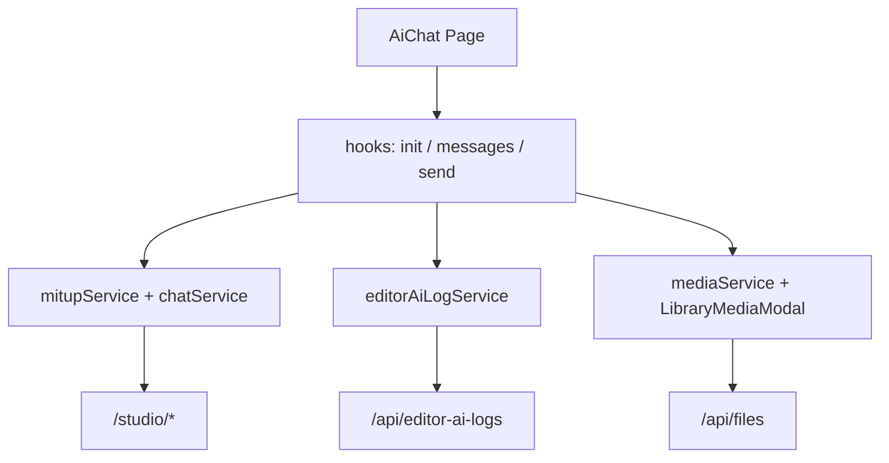

# AI-чат — план задач (Mitup + интерфейс в стиле DeepSeek)

Документ описывает поэтапную реализацию страницы `/ai-chat`: генерация текста и изображений через `ai-api` (Mitup), аудит через `editor-ai-logs`, вложения из Библиотеки. UI ориентирован на [DeepSeek Chat](https://chat.deepseek.com): боковая панель истории, центральная лента сообщений, нижний composer.

**Источники:**
- Бэкенд: `images-sharik-backend/ai-api/MITUP.md`
- Текущая оболочка: `src/views/AiChat/`
- Эталон шапки: `src/views/EditorAiLogs/EditorAiLogs.jsx`
- Picker библиотеки: `src/components/LibraryMediaModal/`
- Логи: `src/services/editorAiLogService.js`

**Базовые URL (прод):**
| Сервис | URL |
|--------|-----|
| Основной API | `https://mp.sharik.ru/api` |
| Studio (ai-api) | `https://mp.sharik.ru/studio` |

**Доступ:** только admin (`AdminProtectedRoute`), маршрут уже есть.

---

## Содержание

1. [Референс UI (DeepSeek)](#1-референс-ui-deepseek)
2. [Архитектура и зависимости](#2-архитектура-и-зависимости)
3. [Фаза 0 — Подготовка инфраструктуры](#фаза-0--подготовка-инфраструктуры)
4. [Фаза 1 — MVP: текстовый чат](#фаза-1--mvp-текстовый-чат)
5. [Фаза 2 — UI DeepSeek: sidebar и лента](#фаза-2--ui-deepseek-sidebar-и-лента)
6. [Фаза 3 — Composer и настройки модели](#фаза-3--composer-и-настройки-модели)
7. [Фаза 4 — Вложения из Библиотеки](#фаза-4--вложения-из-библиотеки)
8. [Фаза 5 — Генерация изображений](#фаза-5--генерация-изображений)
9. [Фаза 6 — Надёжность и polish](#фаза-6--надёжность-и-polish)
10. [Фаза 7 — Admin UI (AI-логи)](#фаза-7--admin-ui-ai-логи)
11. [Чеклист приёмки](#чеклист-приёмки)
12. [Структура файлов (целевая)](#структура-файлов-целевая)

---

## 1. Референс UI (DeepSeek)

### Макет

```
┌─────────────────────────────────────────────────────────────────────────┐
│  Sharik header (как AI-логи): [← Назад]  AI-чат    баланс · лимит/мин   │
├──────────────┬──────────────────────────────────────────────────────────┤
│ SIDEBAR      │                    MAIN (центр, max-width ~768px)         │
│ ~260px       │                                                          │
│              │     [assistant bubble — слева, светлый фон]              │
│ [+ Новый чат]│                                                          │
│              │              [user bubble — справа, акцент]               │
│ · Чат 1      │                                                          │
│ · Чат 2      │     [assistant · processing · spinner]                   │
│ · …          │                                                          │
│              ├──────────────────────────────────────────────────────────┤
│              │ COMPOSER (sticky bottom, скруглённая «карточка»)          │
│              │ [модель ▼] [⚙ настройки]                                 │
│              │ ┌────────────────────────────────────────── [📎] [➤] ─┐  │
│              │ │ placeholder: «Сообщение…»                            │  │
│              │ └──────────────────────────────────────────────────────┘  │
└──────────────┴──────────────────────────────────────────────────────────┘
```

### Принципы стиля DeepSeek (адаптация под Sharik)

| Элемент | DeepSeek | Адаптация Sharik |
|---------|----------|------------------|
| Sidebar | тёмно-серый / контраст с main | светлая тема проекта, `#f5f5f7` фон sidebar |
| Новый чат | кнопка сверху sidebar, full-width | `+ Новый чат`, primary outline |
| Список чатов | title + hover, active highlight | truncate title, `lastMessageAt`, active border-left |
| Лента | узкая колонка по центру | `max-width: 768px`, `margin: 0 auto` |
| User message | bubble справа | `#e8f0fe` или brand-accent |
| Assistant | bubble слева, markdown-ready | `#f7f7f8`, поддержка `pre`/code |
| Composer | большая textarea, send справа | Enter = send, Shift+Enter = newline |
| Модель | dropdown в composer | группировка по `ai` (Gemini, OpenAI…) |
| Настройки | collapsible panel / popover | temperature, top_p, thinking, web_search |
| Статусы | typing indicator | `pending` / `processing` — анимация точек |
| Пустой чат | welcome + подсказки | «Начните диалог» + chips с примерами промптов |
| Mobile | sidebar → drawer | breakpoint ~768px, hamburger |

### CSS-переменные (рекомендуется)

```css
--ai-chat-sidebar-width: 260px;
--ai-chat-content-max-width: 768px;
--ai-chat-bubble-user-bg: #e8f0fe;
--ai-chat-bubble-assistant-bg: #f7f7f8;
--ai-chat-composer-bg: #fff;
--ai-chat-border: rgba(0, 0, 0, 0.08);
--ai-chat-accent: /* brand primary */;
```

---

## 2. Архитектура и зависимости



### Канонический flow отправки (обязательный порядок)

```
1. POST  /studio/chats/:sessionId/messages          → user message
2. POST  /studio/chats/:sessionId/messages          → assistant (pending)
3. POST  /api/editor-ai-logs                        → logId
4. POST  /studio/providers/generate                 → taskId
5. PATCH /api/editor-ai-logs/:logId/processing      → providerTaskId
6. PATCH /studio/chats/.../messages/:assistantId  → processing
7. GET   /studio/providers/stream/:taskId           → SSE
8. PATCH /studio/chats/.../messages/:assistantId  → completed + result
9. PATCH /api/editor-ai-logs/:logId/complete        → responseData
10. Обновить balance в UI
```

---

## Фаза 0 — Подготовка инфраструктуры

### +++ TASK-0.1 — Константы и базовый URL Studio

**Описание:** добавить `STUDIO_BASE` рядом с существующим `REACT_APP_API_URL`.

**Файлы:**
- `src/services/fetch/fetchBase.js` — экспорт `getStudioBaseUrl()` или константа
- `.env.example` (если есть) — `REACT_APP_STUDIO_URL` (опционально)

**Критерии приёмки:**
- [+] Studio-запросы идут на `{base}/studio/...`
- [х] Локально работает `http://localhost:3002` через proxy или env

**Зависимости:** нет

---

### +++ TASK-0.2 — Сервис Mitup (`mitupService.js`)

**Описание:** обёртки над `/studio/providers/*`.

**Методы:**
| Метод | Endpoint |
|-------|----------|
| `apiGetMitupModels(companyId)` | `GET /providers/models` |
| `apiGetMitupLimits(companyId)` | `GET /providers/limits` |
| `apiGetMitupBalance(companyId)` | `GET /providers/balance` |
| `apiMitupGenerate(body)` | `POST /providers/generate` |
| `apiMitupStatus(taskId, companyId)` | `GET /providers/status/:taskId` |
| `streamMitupResult(taskId, companyId, signal)` | `GET /providers/stream/:taskId` (SSE через fetch) |

**Критерии приёмки:**
- [+] Все методы передают `Authorization: Bearer`
- [+] SSE-парсер обрабатывает `submitted`, `processing`, `completed`, `error`, `timeout`
- [+] При обрыве stream выбрасывается типизированная ошибка для fallback

**Зависимости:** TASK-0.1

---

### +++ TASK-0.3 — Сервис чатов (`chatService.js`)

**Описание:** обёртки над `/studio/chats/*` и `/studio/files/*`.

**Методы:**
| Метод | Endpoint |
|-------|----------|
| `apiCreateChatSession(body)` | `POST /chats` |
| `apiGetChatSessions(params)` | `GET /chats` |
| `apiGetChatSession(sessionId, companyId)` | `GET /chats/:id` |
| `apiPatchChatSession(sessionId, body, companyId)` | `PATCH /chats/:id` |
| `apiArchiveChatSession(sessionId, companyId)` | `DELETE /chats/:id` |
| `apiGetChatMessages(sessionId, params)` | `GET /chats/:id/messages` |
| `apiPostChatMessage(sessionId, body, companyId)` | `POST /chats/:id/messages` |
| `apiPatchChatMessage(sessionId, messageId, body, companyId)` | `PATCH /chats/:id/messages/:messageId` |
| `apiGetStudioFileUrl(fileId, companyId)` | `GET /files/:fileId/url` |

**Критерии приёмки:**
- [+] Query `companyId` добавляется ко всем запросам
- [+] Типы ответов документированы в JSDoc

**Зависимости:** TASK-0.1

---

### +++ TASK-0.4 — Расширение `editorAiLogService`

**Описание:** добавить этап processing между start и complete.

**Файлы:**
- `src/services/editorAiLogService.js` — `apiProcessingEditorAiLog(logId, { providerTaskId })`

**Критерии приёмки:**
- [+] `PATCH /api/editor-ai-logs/:id/processing` работает
- [+] Существующий Photoroom-flow не сломан

**Зависимости:** нет

---

### +++ TASK-0.5 — Утилиты Mitup

**Описание:** чистые функции без UI.

**Файл:** `src/views/AiChat/utils/mitupModels.js`

**Функции:**
- `filterTextModels(models)` — `out_text === true`
- `filterImageModels(models)` — `out_image === true`
- `groupModelsByProvider(models)` — по полю `ai`
- `canAttachFromLibrary(model)` — `in_image === true`
- `isExtensionAllowed(model, fileName)` — проверка `ext`
- `getModelLabel(model)` — `output_name` + `best_for`
- `filterModelsByOutputType(models, outputType)` — helper для UI

**Файл:** `src/views/AiChat/utils/mitupLogPayload.js`
- `buildTextLogStartPayload(...)` — `generateText`, `section: ai_text_generation`, `provider: mitup`, `meta.source: page_chat`
- `buildImageLogStartPayload(...)` — `generateImage`, `section: ai_image_generation`
- `buildLogCompletePayload(result, startedAt)` — `textResult`, `cost`, `balanceAfter`
- `buildLogErrorCompletePayload(...)` — ошибки / timeout для `complete` лога

**Файл:** `src/views/AiChat/utils/mitupErrors.js`
- Маппинг `MITUP_*` → пользовательские сообщения
- `normalizeMitupError`, `getMitupUserMessage`, `getMitupErrorLifecycleStatus`

**Критерии приёмки:**
- [+] Unit-тесты опционально; минимум — ручная проверка на mock-данных из MITUP.md

**Зависимости:** нет

**Фаза 0 завершена** (0.1–0.5).

---

## Фаза 1 — MVP: текстовый чат

### TASK-1.1 — Хук `useAiChatInit`

**Описание:** загрузка данных при mount страницы.

**Файл:** `src/views/AiChat/hooks/useAiChatInit.js`

**Параллельные запросы:**
```javascript
Promise.all([
  apiGetMitupModels(companyId),
  apiGetMitupLimits(companyId),
  apiGetMitupBalance(companyId),
  apiGetChatSessions({ companyId, page: 1, limit: 20 }),
])
```

**State:** `models`, `limits`, `balance`, `sessions`, `loading`, `error`, `mitupConfigured`

**Критерии приёмки:**
- [ ] При отсутствии Mitup-ключа — banner «Mitup не настроен»
- [ ] `balance === null` → отображение «—»

**Зависимости:** TASK-0.2, TASK-0.3

---

### TASK-1.2 — Хук `useChatMessages`

**Описание:** загрузка и пагинация сообщений активной сессии.

**Файл:** `src/views/AiChat/hooks/useChatMessages.js`

**Поведение:**
- `loadMessages(sessionId)` → `GET /chats/:id/messages`
- Локальный append после send (optimistic optional)
- Scroll to bottom on new message

**Критерии приёмки:**
- [ ] Переключение сессии сбрасывает messages и загружает новые
- [ ] `activeSessionId === null` → пустая лента (welcome state)

**Зависимости:** TASK-0.3

---

### TASK-1.3 — Хук `useSendChatMessage` (ядро)

**Описание:** канонический flow шагов 1–10 для `out_text`.

**Файл:** `src/views/AiChat/hooks/useSendChatMessage.js`

**Логика auto-create чата:**
```javascript
if (!sessionId) {
  sessionId = await apiCreateChatSession({
    companyId,
    title: prompt.slice(0, 50) || 'Новый чат',
    defaultModel: selectedModel,
    defaultTemperature,
    defaultTopP,
  });
}
```

**Fallback:** при SSE timeout/error → `apiMitupStatus` → complete если `done: true`

**Критерии приёмки:**
- [ ] Первое сообщение без выбранного чата создаёт сессию «под капотом»
- [ ] Assistant message проходит статусы pending → processing → completed | failed
- [ ] Лог создаётся с `provider: mitup`, `meta.source: page_chat`
- [ ] При ошибке лог завершается со `status: error`

**Зависимости:** TASK-0.2, TASK-0.3, TASK-0.4, TASK-0.5

---

### TASK-1.4 — Минимальный layout `AiChat.jsx`

**Описание:** собрать hooks + placeholder-компоненты без финального дизайна.

**Файлы:**
- `src/views/AiChat/AiChat.jsx` — refactor
- `src/views/AiChat/components/AiChatLayout.jsx` — sidebar + main + composer slots

**Критерии приёмки:**
- [ ] E2E: отправка текста → ответ в ленте → запись в AI-логах
- [ ] Шапка как у AI-логов сохранена

**Зависимости:** TASK-1.1, TASK-1.2, TASK-1.3

---

## Фаза 2 — UI DeepSeek: sidebar и лента

### TASK-2.1 — Компонент `AiChatSidebar`

**Файл:** `src/views/AiChat/components/AiChatSidebar.jsx`

**Элементы:**
- Кнопка «+ Новый чат» (`activeSessionId = null`, очистка composer)
- Список сессий: title (truncate), relative time (`lastMessageAt`)
- Active state: левая полоска accent
- Контекстное меню (фаза 6): переименовать, удалить
- Empty state: «Нет чатов»

**Стили:** `AiChatSidebar.css`

**Критерии приёмки:**
- [ ] Клик по чату загружает messages
- [ ] Новый чат после первой отправки появляется в списке
- [ ] Sidebar collapsible на mobile (drawer)

**Зависимости:** TASK-1.4

---

### TASK-2.2 — Компонент `AiChatMessageList`

**Файл:** `src/views/AiChat/components/AiChatMessageList.jsx`

**Элементы:**
- Welcome screen (пустой чат): заголовок + example chips («Опиши товар…», «SEO-текст…»)
- `AiChatMessageBubble` — user (справа) / assistant (слева)
- Статусы assistant: pending (typing dots), processing (spinner), failed (error + retry)
- Metadata footer: модель, `cost.amount` ₽
- Auto-scroll to bottom
- Центрирование колонки `max-width: 768px`

**Стили:** `AiChatMessageList.css`, `AiChatMessageBubble.css`

**Критерии приёмки:**
- [ ] Длинный текст переносится, code blocks с `pre`
- [ ] User/assistant визually различимы как в DeepSeek
- [ ] Welcome chips заполняют composer по клику

**Зависимости:** TASK-2.1

---

### TASK-2.3 — Компонент `AiChatStatusBar`

**Файл:** `src/views/AiChat/components/AiChatStatusBar.jsx`

**Элементы (в шапке справа или под заголовком):**
- Баланс Mitup (`balance` ₽ или «—»)
- Лимит минуты (`usage.minute / max.minute`)
- Индикатор rate limit (красный при `usage >= max`)

**Критерии приёмки:**
- [ ] Обновление баланса после completed
- [ ] Блокировка send при превышении лимита

**Зависимости:** TASK-1.1

---

### TASK-2.4 — Общие стили страницы

**Файл:** `src/views/AiChat/AiChat.css` — refactor

**Критерии приёмки:**
- [ ] `100vh`, без double scroll
- [ ] Sidebar + main flex layout
- [ ] Согласованность с `images.css` (`.header-section`, `.button-back`)

**Зависимости:** TASK-2.1, TASK-2.2

---

## Фаза 3 — Composer и настройки модели

### TASK-3.1 — Компонент `AiChatComposer`

**Файл:** `src/views/AiChat/components/AiChatComposer.jsx`

**Элементы (стиль DeepSeek — rounded card):**
- Textarea: placeholder «Сообщение…», max 2000 символов + counter
- Enter → send, Shift+Enter → newline
- Кнопка Send (disabled: empty prompt, sending, rate limit)
- Sticky bottom в main area

**Критерии приёмки:**
- [ ] Textarea auto-resize до max-height ~200px
- [ ] Disabled во время pending/processing последнего assistant message

**Зависимости:** TASK-2.4

---

### TASK-3.2 — Комponent `AiChatModelSelect`

**Файл:** `src/views/AiChat/components/AiChatModelSelect.jsx`

**Элементы:**
- Dropdown / custom select над composer
- Группировка по `ai` (optgroup)
- Subtitle/tooltip: `best_for`
- Фильтр списка по режиму (`out_text` / `out_image`)
- Persist выбора в session defaults при смене модели

**Критерии приёмки:**
- [ ] При открытии чата подставляется `session.defaultModel` или первая text-модель
- [ ] Label = `output_name`

**Зависимости:** TASK-0.5, TASK-3.1

---

### TASK-3.3 — Комponent `AiChatSettingsPanel`

**Файл:** `src/views/AiChat/components/AiChatSettingsPanel.jsx`

**Элементы (popover / collapsible «⚙ Настройки»):**

| Режим | Поля |
|-------|------|
| `out_text` | temperature (0–1), top_p (0–1), thinking (toggle), web_search (toggle) |
| `out_image` | temperature, top_p, image_size, image_quality, response_format |

**Критерии приёмки:**
- [ ] Значения передаются в `POST /providers/generate` → `ai.*`
- [ ] Defaults: temperature 0.9, top_p 1.0

**Зависимости:** TASK-3.1

---

### TASK-3.4 — Переключатель режима «Текст / Картинка»

**Файл:** часть `AiChatComposer` или отдельный `AiChatModeSwitch.jsx`

**Поведение:**
- Toggle/tab: `out_text` | `out_image`
- Смена режима → перефильтровать models, сбросить несовместимые настройки

**Критерии приёмки:**
- [ ] MVP: режим «Текст» активен по умолчанию
- [ ] Режим «Картинка» подключён в TASK-5.x

**Зависимости:** TASK-3.2

---

## Фаза 4 — Вложения из Библиотеки

### TASK-4.1 — Кнопка «Из библиотеки» в composer

**Описание:** показывать только при `selectedModel.in_image === true`.

**Файлы:**
- `src/views/AiChat/components/AiChatComposer.jsx`
- Reuse: `LibraryMediaModal` (single-select mode)

**Props для modal (если нужно расширить):**
- `selectionMode: 'single'`
- `onSelect: (file) => void`
- `mimeTypes: 'image/jpeg,image/png,image/webp'`

**Критерии приёмки:**
- [ ] Кнопка скрыта для моделей без `in_image`
- [ ] Выбранный файл отображается в preview

**Зависимости:** TASK-3.1

---

### TASK-4.2 — Комponent `AiChatAttachmentPreview`

**Файл:** `src/views/AiChat/components/AiChatAttachmentPreview.jsx`

**Элементы:**
- Thumbnail + fileName
- Кнопка удалить (×)
- Проверка размера ≤ 5 МБ, предупреждение по `ext`

**Критерии приёмки:**
- [ ] В user message bubble показывается thumbnail
- [ ] В generate: `{ type: 'input_file', fileId }`
- [ ] В log start: `requestData.attachments`

**Зависимости:** TASK-4.1, TASK-1.3

---

### TASK-4.3 — Отображение вложений в истории

**Описание:** рендер `content.attachments[]` в user bubbles.

**Критерии приёмки:**
- [ ] URL из attachments или `apiGetStudioFileUrl` для превью
- [ ] Клик → lightbox (optional)

**Зависимости:** TASK-2.2, TASK-4.2

---

## Фаза 5 — Генерация изображений

### TASK-5.1 — Расширить `useSendChatMessage` для `out_image`

**Изменения:**
- `type: 'out_image'` в generate
- `response_format`, `image_size`, `image_quality` в `ai`
- Log: `generateImage`, `ai_image_generation`
- Complete: `imageResult.files`

**Критерии приёмки:**
- [ ] Assistant bubble показывает grid картинок из `result.files`
- [ ] Persisted URLs (`/media/...`) открываются в новой вкладке

**Зависимости:** TASK-3.4, TASK-1.3

---

### TASK-5.2 — Комponent `AiChatImageResult`

**Файл:** `src/views/AiChat/components/AiChatImageResult.jsx`

**Элементы:**
- Grid 1–3 колонки
- Lazy load, alt = fileName
- Badge «AI» / cost

**Критерии приёмки:**
- [ ] Поддержка нескольких files в одном ответе
- [ ] Fallback если только `text` без files

**Зависимости:** TASK-5.1

---

## Фаза 6 — Надёжность и polish

### TASK-6.1 — Retry failed message

**Описание:** кнопка «Повторить» на assistant со `status: failed`.

**Поведение:** повтор generate с тем же user prompt + settings (новый assistant message).

**Критерии приёмки:**
- [ ] Не дублирует user message при retry
- [ ] Новый log + новый taskId

**Зависимости:** TASK-1.3

---

### TASK-6.2 — SSE fallback и reconnect

**Описание:** при `timeout` / network error → `apiMitupStatus`.

**Критерии приёмки:**
- [ ] UI не зависает в processing > 120s
- [ ] Пользователь видит понятное сообщение

**Зависимости:** TASK-1.3

---

### TASK-6.3 — Управление сессиями

**Элементы:**
- Inline rename title (PATCH session)
- Archive chat (DELETE)
- Confirm modal

**Критерии приёмки:**
- [ ] Архивированный чат исчезает из sidebar
- [ ] Title auto-update от первого промпта (optional)

**Зависимости:** TASK-2.1

---

### TASK-6.4 — Mobile UX

**Элементы:**
- Sidebar → overlay drawer
- Hamburger в header
- Composer full-width

**Критерии приёмки:**
- [ ] Работает на viewport ≤ 768px
- [ ] Touch-friendly hit areas ≥ 44px

**Зависимости:** TASK-2.4

---

### TASK-6.5 — i18n

**Файлы:** `src/assets/lang/{ru,en,de,it}.json`

**Ключи (пример):**
```json
"aiChat": {
  "newChat": "Новый чат",
  "placeholder": "Сообщение…",
  "thinking": "Думает…",
  "settings": "Настройки",
  "attachFromLibrary": "Из библиотеки",
  "modeText": "Текст",
  "modeImage": "Картинка",
  "balance": "Баланс",
  "limit": "Лимит",
  "mitupNotConfigured": "Mitup не настроен",
  "retry": "Повторить"
}
```

**Критерии приёмки:**
- [ ] Все user-visible строки через `t()`
- [ ] RU/EN/DE/IT заполнены

**Зависимости:** TASK-2.x, TASK-3.x

---

## Фаза 7 — Admin UI (AI-логи)

### TASK-7.1 — Фильтры EditorAiLogs

**Файл:** `src/views/EditorAiLogs/editorAiLogsHelpers.js`

**Добавить:**
- `PROVIDER_FILTER_OPTIONS`: `{ id: 'mitup', label: 'Mitup' }`
- `AI_OPERATION_OPTIONS`: `generateText`, `generateImage`
- `SECTION_FILTER_OPTIONS`: `ai_text_generation`, `ai_image_generation`

**Критерии приёмки:**
- [ ] Логи чата фильтруются по source `page_chat`
- [ ] В таблице видны cost и model из requestConfig

**Зависимости:** TASK-1.3

---

### TASK-7.2 — Детальный modal лога Mitup

**Файл:** `src/views/EditorAiLogs/AiLogDetailModal.jsx`

**Изменения:** отображение `textResult`, `imageResult`, `balanceAfter`, `sessionId` из meta.

**Критерии приёмки:**
- [ ] Mitup-логи читаемы так же как Photoroom

**Зависимости:** TASK-7.1

---

## Чеклист приёмки

### Функциональность
- [ ] Admin открывает `/ai-chat`, видит sidebar + welcome
- [ ] Первое сообщение без выбранного чата создаёт session автоматически
- [ ] Текстовая генерация: prompt → SSE → ответ в ленте
- [ ] Лог в `/ai-logs` с `provider: mitup`, `meta.source: page_chat`
- [ ] Баланс и лимит отображаются и обновляются
- [ ] Модель, temperature, top_p, thinking, web_search работают
- [ ] Вложение из Библиотеки (если `in_image`)
- [ ] Генерация изображений (режим «Картинка»)
- [ ] Retry при ошибке
- [ ] Archive / rename чата

### UI (DeepSeek)
- [ ] Sidebar с историей и «Новый чат»
- [ ] Центрированная лента max-width ~768px
- [ ] User справа, assistant слева
- [ ] Composer sticky, rounded card
- [ ] Typing indicator при processing
- [ ] Mobile drawer

### Нефункциональные
- [ ] Промпт ≤ 2000 символов
- [ ] JWT на всех запросах
- [ ] Нет утечки Mitup API key на фронт
- [ ] `npm run build` без ошибок

---

## Структура файлов (целевая)

```
src/
├── services/
│   ├── editorAiLogService.js      # + apiProcessingEditorAiLog
│   ├── mitupService.js            # NEW
│   └── chatService.js             # NEW
├── views/
│   └── AiChat/
│       ├── index.js
│       ├── AiChat.jsx
│       ├── AiChat.css
│       ├── hooks/
│       │   ├── useAiChatInit.js
│       │   ├── useChatMessages.js
│       │   └── useSendChatMessage.js
│       ├── components/
│       │   ├── AiChatLayout.jsx
│       │   ├── AiChatSidebar.jsx
│       │   ├── AiChatSidebar.css
│       │   ├── AiChatMessageList.jsx
│       │   ├── AiChatMessageBubble.jsx
│       │   ├── AiChatComposer.jsx
│       │   ├── AiChatModelSelect.jsx
│       │   ├── AiChatSettingsPanel.jsx
│       │   ├── AiChatModeSwitch.jsx
│       │   ├── AiChatStatusBar.jsx
│       │   ├── AiChatAttachmentPreview.jsx
│       │   └── AiChatImageResult.jsx
│       └── utils/
│           ├── mitupModels.js
│           ├── mitupLogPayload.js
│           └── mitupErrors.js
└── assets/lang/
    └── *.json                     # секция aiChat.*
```

---

## Порядок выполнения (рекомендуемый)

```
Фаза 0 (0.1 → 0.5)  ──►  Фаза 1 (1.1 → 1.4)  ──►  E2E smoke test
                              │
                              ▼
                    Фаза 2 (UI skeleton DeepSeek)
                              │
                              ▼
                    Фаза 3 (Composer + settings)
                              │
              ┌───────────────┴───────────────┐
              ▼                               ▼
        Фаза 4 (attachments)           Фаза 5 (images)
              │                               │
              └───────────────┬───────────────┘
                              ▼
                    Фаза 6 (polish) + Фаза 7 (logs UI)
```

---

## Связанные документы

- `images-sharik-backend/ai-api/MITUP.md` — API reference
- `documentation.md` — общая документация проекта
- `src/views/EditorAiLogs/` — admin просмотр логов

---

*Версия документа: 1.0 · Дата: 2026-06-05*
