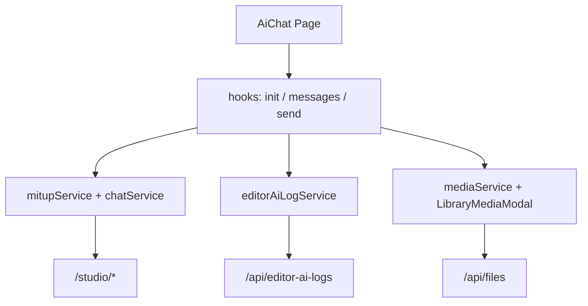

# AI-чат — план задач (Mitup + интерфейс в стиле DeepSeek)

Документ описывает поэтапную реализацию страницы `/ai-chat`: генерация текста и изображений через `ai-api` (Mitup), аудит через `editor-ai-logs`, вложения из Библиотеки. UI ориентирован на [DeepSeek Chat](https://chat.deepseek.com): боковая панель истории, центральная лента сообщений, нижний composer.

**Источники:**
- Бэкенд: `images-sharik-backend/ai-api/MITUP.md`
- Текущая оболочка: `src/views/AiChat/`
- Эталон шапки: `src/views/EditorAiLogs/EditorAiLogs.jsx`
- Picker библиотеки: `src/components/LibraryMediaModal/`
- Логи: `src/services/editorAiLogService.js`

**Базовые URL (прод):**
| Сервис | URL |
|--------|-----|
| Основной API | `https://mp.sharik.ru/api` |
| Studio (ai-api) | `https://mp.sharik.ru/studio` |

**Доступ:** только admin (`AdminProtectedRoute`), маршрут уже есть.

---

## Содержание

1. [Референс UI (DeepSeek)](#1-референс-ui-deepseek)
2. [Архитектура и зависимости](#2-архитектура-и-зависимости)
3. [Фаза 0 — Подготовка инфраструктуры](#фаза-0--подготовка-инфраструктуры)
4. [Фаза 1 — MVP: текстовый чат](#фаза-1--mvp-текстовый-чат)
5. [Фаза 2 — UI DeepSeek: sidebar и лента ✅](#фаза-2--ui-deepseek-sidebar-и-лента-)
5a. [Аудит внеплановых изменений (2026-06)](#аудит-внеплановых-изменений-2026-06)
6. [Фаза 3 — Composer и настройки модели ✅](#фаза-3--composer-и-настройки-модели-)
7. [Фаза 4 — Вложения из Библиотеки](#фаза-4--вложения-из-библиотеки)
8. [Фаза 5 — Генерация изображений](#фаза-5--генерация-изображений)
9. [Фаза 6 — Надёжность и polish](#фаза-6--надёжность-и-polish)
10. [Фаза 7 — Admin UI (AI-логи)](#фаза-7--admin-ui-ai-логи)
11. [Чеклист приёмки](#чеклист-приёмки)
12. [Структура файлов](#структура-файлов)

---

## 1. Референс UI (DeepSeek)

### Макет

```
┌─────────────────────────────────────────────────────────────────────────┐
│  Sharik header (как AI-логи): [← Назад]  AI-чат    баланс · лимит/мин   │
├──────────────┬──────────────────────────────────────────────────────────┤
│ SIDEBAR      │                    MAIN (центр, max-width ~768px)         │
│ ~260px       │                                                          │
│              │     [assistant bubble — слева, светлый фон]              │
│ [+ Новый чат]│                                                          │
│              │              [user bubble — справа, акцент]               │
│ · Чат 1      │                                                          │
│ · Чат 2      │     [assistant · «Хороший вопрос…» / typewriter]       │
│ · …          │                                                          │
│              ├──────────────────────────────────────────────────────────┤
│              │ COMPOSER (sticky bottom или по центру в welcome)          │
│              │ [модель ▼ + best_for]                          [↑ send]   │
└──────────────┴──────────────────────────────────────────────────────────┘
```

### Принципы стиля DeepSeek (адаптация под Sharik)

| Элемент | DeepSeek | Адаптация Sharik |
|---------|----------|------------------|
| Sidebar | тёмно-серый / контраст с main | светлая тема проекта, `#f5f5f7` фон sidebar |
| Новый чат | кнопка сверху sidebar, full-width | `+ Новый чат`, primary outline |
| Список чатов | title + hover, active highlight | truncate title, `lastMessageAt`, active border-left |
| Лента | узкая колонка по центру | `max-width: 768px`, `margin: 0 auto` |
| User message | bubble справа | `#e8f0fe` или brand-accent |
| Assistant | bubble слева, markdown-ready | `#f7f7f8`, поддержка `pre`/code |
| Composer | большая textarea, send справа | серая карточка `#f2f2f4`, textarea auto-resize, модель pill + круглая кнопка ↑ |
| Модель | dropdown в composer | `AiChatModelSelect`: группировка по `ai`, фильтр `out_text`/`out_image`, persist `defaultModel` |
| Настройки | collapsible panel / popover | `AiChatSettingsPanel`: temperature, top_p, thinking, web_search (+ image-поля в режиме «Картинка») |
| Режим | — | `AiChatModeSwitch`: только на welcome; после первого сообщения режим фиксируется для чата |
| Статусы | typing indicator | «Хороший вопрос, надо подумать» + подпрыгивающие точки; затем typewriter-ответ |
| Пустой чат | welcome + подсказки | logo + «Здравствуйте, {имя}! …»; composer по центру до первого сообщения |
| Mobile | sidebar → drawer | breakpoint ~768px, hamburger |

### CSS-переменные (рекомендуется)

```css
--ai-chat-sidebar-width: 260px;
--ai-chat-content-max-width: 768px;
--ai-chat-bubble-user-bg: #e8f0fe;
--ai-chat-bubble-assistant-bg: #f7f7f8;
--ai-chat-composer-bg: #f2f2f4;
--ai-chat-border: rgba(0, 0, 0, 0.08);
--ai-chat-accent: /* brand primary */;
```

---

## 2. Архитектура и зависимости



### Канонический flow отправки (обязательный порядок)

```
1. POST  /studio/chats/:sessionId/messages          → user message
2. POST  /studio/chats/:sessionId/messages          → assistant (pending)
3. POST  /api/editor-ai-logs                        → logId
4. POST  /studio/providers/generate                 → taskId
5. PATCH /api/editor-ai-logs/:logId/processing      → providerTaskId
6. PATCH /studio/chats/.../messages/:assistantId  → processing
7. GET   /studio/providers/stream/:taskId           → SSE
8. PATCH /studio/chats/.../messages/:assistantId  → completed + result
9. PATCH /api/editor-ai-logs/:logId/complete        → responseData
10. Обновить balance в UI
```

---

## Фаза 0 — Подготовка инфраструктуры ✅

### +++ TASK-0.1 — Константы и базовый URL Studio

**Описание:** добавить `STUDIO_BASE` рядом с существующим `REACT_APP_API_URL`.

**Файлы:**
- `src/services/fetch/fetchBase.js` — экспорт `getStudioBaseUrl()` или константа
- `.env.example` (если есть) — `REACT_APP_STUDIO_URL` (опционально)

**Критерии приёмки:**
- [+] Studio-запросы идут на `{base}/studio/...`
- [х] Локально работает `http://localhost:3002` через proxy или env

**Зависимости:** нет

---

### +++ TASK-0.2 — Сервис Mitup (`mitupService.js`)

**Описание:** обёртки над `/studio/providers/*`.

**Методы:**
| Метод | Endpoint |
|-------|----------|
| `apiGetMitupModels(companyId)` | `GET /providers/models` |
| `apiGetMitupLimits(companyId)` | `GET /providers/limits` |
| `apiGetMitupBalance(companyId)` | `GET /providers/balance` |
| `apiMitupGenerate(body)` | `POST /providers/generate` |
| `apiMitupStatus(taskId, companyId)` | `GET /providers/status/:taskId` |
| `streamMitupResult(taskId, companyId, signal)` | `GET /providers/stream/:taskId` (SSE через fetch) |

**Критерии приёмки:**
- [+] Все методы передают `Authorization: Bearer`
- [+] SSE-парсер обрабатывает `submitted`, `processing`, `completed`, `error`, `timeout`
- [+] При обрыве stream выбрасывается типизированная ошибка для fallback

**Зависимости:** TASK-0.1

---

### +++ TASK-0.3 — Сервис чатов (`chatService.js`)

**Описание:** обёртки над `/studio/chats/*` и `/studio/files/*`.

**Методы:**
| Метод | Endpoint |
|-------|----------|
| `apiCreateChatSession(body)` | `POST /chats` |
| `apiGetChatSessions(params)` | `GET /chats` |
| `apiGetChatSession(sessionId, companyId)` | `GET /chats/:id` |
| `apiPatchChatSession(sessionId, body, companyId)` | `PATCH /chats/:id` |
| `apiArchiveChatSession(sessionId, companyId)` | `DELETE /chats/:id` |
| `apiGetChatMessages(sessionId, params)` | `GET /chats/:id/messages` |
| `apiPostChatMessage(sessionId, body, companyId)` | `POST /chats/:id/messages` |
| `apiPatchChatMessage(sessionId, messageId, body, companyId)` | `PATCH /chats/:id/messages/:messageId` |
| `apiGetStudioFileUrl(fileId, companyId)` | `GET /files/:fileId/url` |

**Критерии приёмки:**
- [+] Query `companyId` добавляется ко всем запросам
- [+] Типы ответов документированы в JSDoc

**Зависимости:** TASK-0.1

---

### +++ TASK-0.4 — Расширение `editorAiLogService`

**Описание:** добавить этап processing между start и complete.

**Файлы:**
- `src/services/editorAiLogService.js` — `apiProcessingEditorAiLog(logId, { providerTaskId })`

**Критерии приёмки:**
- [+] `PATCH /api/editor-ai-logs/:id/processing` работает
- [+] Существующий Photoroom-flow не сломан

**Зависимости:** нет

---

### +++ TASK-0.5 — Утилиты Mitup

**Описание:** чистые функции без UI.

**Файл:** `src/utils/mitupModels.js`

**Функции:**
- `filterTextModels(models)` — `out_text === true`
- `filterImageModels(models)` — `out_image === true`
- `groupModelsByProvider(models)` — по полю `ai`
- `canAttachFromLibrary(model)` — `in_image === true`
- `isExtensionAllowed(model, fileName)` — проверка `ext`
- `getModelLabel(model)` — `output_name` + `best_for`
- `filterModelsByOutputType(models, outputType)` — helper для UI

**Файл:** `src/utils/mitupLogPayload.js`
- `buildTextLogStartPayload(...)` — `generateText`, `section: ai_text_generation`, `provider: mitup`, `meta.source: page_chat`
- `buildImageLogStartPayload(...)` — `generateImage`, `section: ai_image_generation`
- `buildLogCompletePayload(result, startedAt)` — `textResult`, `cost`, `balanceAfter`
- `buildLogErrorCompletePayload(...)` — ошибки / timeout для `complete` лога

**Файл:** `src/utils/mitupErrors.js`
- Маппинг `MITUP_*` → пользовательские сообщения
- `normalizeMitupError`, `getMitupUserMessage`, `getMitupErrorLifecycleStatus`

**Критерии приёмки:**
- [+] Unit-тест `mitupLogPayload.test.js` — payload лога соответствует валидатору `editor-ai-logs` (без `thinking`/`webSearch` в `requestConfig.model`)

**Зависимости:** нет

---

### **Фаза 0** — это «фундамент» AI-чата. Пользователь пока не увидит нового интерфейса, но всё необходимое для него на фронте подготовлено.

**Что уже есть**
1. **Подключение к AI-сервису Sharik**
Приложение знает, куда обращаться: основной сайт mp.sharik.ru и отдельный AI-раздел /studio (Mitup).

2. **Сервис генерации (Mitup)**
Готовы запросы: список моделей, лимиты, баланс, запуск генерации, ожидание ответа (в т.ч. при обрыве связи — запасной способ проверить статус).

3. **Сервис чатов**
Готовы операции: создать чат, список чатов, сообщения, переименование, архив, прикрепление файлов из библиотеки.

4. **Журнал AI-операций**
Добавлен промежуточный шаг «идёт обработка» — чтобы в admin-логах было видно, что задача отправлена в Mitup, а не только «начало» и «конец».

5. **Вспомогательная логика**
  - какие модели для текста / картинок;
  - когда можно прикрепить файл из библиотеки;
  - как правильно писать записи в логи;
  - понятные сообщения об ошибках (лимит, баланс, таймаут и т.д.).

6. **Страница AI-чат**
У админов уже есть пункт меню и пустая страница с шапкой «Назад + AI-чат» — сам чат ещё не работает.

---

---

## Фаза 1 — MVP: текстовый чат ✅

### +++ TASK-1.1 — Хук `useAiChatInit`

**Описание:** загрузка данных при mount страницы.

**Файл:** `src/hooks/useAiChatInit.js`

**Параллельные запросы:**
```javascript
Promise.all([
  apiGetMitupModels(companyId),
  apiGetMitupLimits(companyId),
  apiGetMitupBalance(companyId),
  apiGetChatSessions({ companyId, page: 1, limit: 20 }),
])
```

**State:** `models`, `limits`, `balance`, `sessions`, `loading`, `error`, `mitupConfigured`

**Критерии приёмки:**
- [+] При отсутствии Mitup-ключа — banner «Mitup не настроен»
- [+] `balance === null` → отображение «—»

**Зависимости:** TASK-0.2, TASK-0.3

---

### +++ TASK-1.2 — Хук `useChatMessages`

**Описание:** загрузка и пагинация сообщений активной сессии.

**Файл:** `src/hooks/useChatMessages.js`

**Поведение:**
- `loadMessages(sessionId)` → `GET /chats/:id/messages`
- Локальный append после send (optimistic optional)
- Scroll to bottom on new message

**Критерии приёмки:**
- [+] Переключение сессии сбрасывает messages и загружает новые
- [+] `activeSessionId === null` → пустая лента (welcome state)

**Зависимости:** TASK-0.3

---

### +++ TASK-1.3 — Хук `useSendChatMessage` (ядро)

**Описание:** канонический flow шагов 1–10 для `out_text`.

**Файл:** `src/hooks/useSendChatMessage.js`

**Логика auto-create чата:**
```javascript
if (!sessionId) {
  sessionId = await apiCreateChatSession({
    companyId,
    title: prompt.slice(0, 50) || 'Новый чат',
    defaultModel: selectedModel,
    defaultTemperature,
    defaultTopP,
  });
}
```

**Fallback:** при SSE timeout/error → `apiMitupStatus` → complete если `done: true`

**Критерии приёмки:**
- [+] Первое сообщение без выбранного чата создаёт сессию «под капотом»
- [+] Assistant message проходит статусы pending → processing → completed | failed
- [+] Лог создаётся с `provider: mitup`, `meta.source: page_chat`
- [+] При ошибке лог завершается со `status: error`

**Зависимости:** TASK-0.2, TASK-0.3, TASK-0.4, TASK-0.5

---

### +++ TASK-1.4 — Минимальный layout `AiChat.jsx`

**Описание:** собрать hooks + placeholder-компоненты без финального дизайна.

**Файлы:**
- `src/views/AiChat/AiChat.jsx` — refactor
- `src/components/AiChat/AiChatLayout.jsx` — sidebar + main + composer slots
- `src/components/AiChat/AiChatHeader.jsx`
- `src/components/AiChat/AiChatSidebar.jsx` (финальный; placeholder снят)
- `src/components/AiChat/AiChatMessageList.jsx`, `AiChatMessageBubble.jsx`
- `src/components/AiChat/AiChatComposer.jsx` + `.css`
- ~~Legacy~~ удалены: `AiChatMessageListPlaceholder.jsx`, `AiChatMessageContent.jsx`
- `src/views/AiChat/AiChat.smoke.test.jsx` — E2E smoke (mock API)

**Критерии приёмки:**
- [+] E2E: отправка текста → ответ в ленте → запись в AI-логах
- [+] Шапка как у AI-логов сохранена

**Зависимости:** TASK-1.1, TASK-1.2, TASK-1.3

---

### **Фаза 1** — это рабочий MVP текстового AI-чата для admin. Фазы 2–3 закрыты (см. [аудит](#аудит-внеплановых-изменений-2026-06)).

**Что уже работает**

1. **Страница `/ai-chat` (только admin)**
   Пункт «AI-чат» в шапке (`SearchHeader`), маршрут через `AdminProtectedRoute`, шапка как у AI-логов: «Назад», заголовок, баланс и лимит/мин.

2. **Инициализация (`useAiChatInit`)**
   Параллельная загрузка моделей, лимитов, баланса, списка чатов и статуса Mitup компании. Banner «Mitup не настроен», если ключ не задан. `prependSession` / `updateBalance` после отправки.

3. **Лента сообщений (`useChatMessages`)**
   Загрузка и пагинация по сессии, welcome при `activeSessionId === null`, append/update локально. Scroll: user-сообщение прижимается над composer; при ответе — typewriter + follow scroll (скроллбар скрыт). `skipInitialLoadRef` — не затирает сообщения при auto-create чата.

4. **Отправка (`useSendChatMessage`)**
   Канонический flow шагов 1–10 для `out_text`: user → assistant (pending) → log → generate → processing → SSE → completed/failed → complete log → обновление баланса. Auto-create сессии при первом сообщении. Fallback SSE: `apiMitupStatus` при обрыве/таймауте. **Дополнительно:** typewriter-эффект ответа; обработка SSE-чанков (`delta` / `text`) при streaming.

5. **Layout и компоненты UI**
   `AiChatLayout` (sidebar | main | composer), welcome-center до первого сообщения. CSS-переменные, sidebar `#f5f5f7`, main `max-width: 768px`, composer — серая карточка.

6. **Markdown в ответах ассистента**
   `AiChatMessageBubble` + `react-markdown`: заголовки, списки, жирный текст, code/pre. `sanitizeChatText` — очистка управляющих символов. Meta footer: модель + cost.

7. **Smoke-тест**
   `AiChat.smoke.test.jsx`: шапка, welcome, отправка → typewriter-ответ → meta → `apiStartEditorAiLog` / `apiCompleteEditorAiLog` с `provider: mitup`, `meta.source: page_chat`. Rate limit и обновление balance/limits. Запуск: `CI=true npm test -- --testPathPattern=AiChat.smoke.test --watchAll=false`

**Ключевые файлы (фаза 1)**

| Task | Файлы |
|------|-------|
| Навигация | `SearchHeader.jsx`, `AllRoutes.jsx` |
| 1.1 | `hooks/useAiChatInit.js` |
| 1.2 | `hooks/useChatMessages.js` |
| 1.3 | `hooks/useSendChatMessage.js` |
| 1.4 | `AiChat.jsx`, `AiChat.css`, `components/AiChat/*`, `AiChat.smoke.test.jsx` |
| Утилиты | `utils/mitupModels.js`, `mitupLogPayload.js`, `mitupErrors.js`, `sanitizeChatText.js`, `chatSession.js`, `aiChatMessage.js`, `aiChatWelcome.js`, `mitupLimits.js` |

**Что сознательно отложено (фаза 4+)**

- Вложения из Библиотеки, генерация изображений (`out_image` send), rename/archive сессий
- i18n всех строк AI-чата
- Retry без дубля user message (TASK-6.1)

**Ручная проверка MVP**

1. Admin → «AI-чат» → welcome (logo + приветствие) + composer по центру; sidebar «+ Новый чат»
2. Выбрать модель в dropdown (описание `best_for` в списке) → отправить текст → сессия в sidebar, user + assistant в ленте
3. Admin → «Логи AI-операций» → запись с `page_chat`, Mitup, cost
4. Переключить сессию → подгрузка истории; «Новый чат» → welcome-center снова

---

## Аудит внеплановых изменений (2026-06)

Изменения, внесённые в процессе UI-итераций **поверх** исходного плана фаз 2–3:

| Область | Было в плане | Фактически |
|---------|--------------|------------|
| Welcome | «Начните диалог» + chips-примеры | Logo (`assets/logo.png`), персональное приветствие (`username` / email), **без chips** |
| Welcome layout | Лента + composer снизу | До первого сообщения: logo + заголовок + **composer по центру** (`isWelcomeCenter`) |
| Composer | Белая карточка, текстовая кнопка Send | Серая карточка `#f2f2f4`, textarea auto-resize, **круглая кнопка ↑**, модель pill в footer |
| Модель | Native `<select>` (фаза 3) | **`AiChatModelSelect`** раньше срока: dropdown вверх, subtitle `best_for` |
| Выбор модели | Auto / первая модель | **Явный выбор** — placeholder «Выберите модель», send только при выбранной модели |
| Статус ожидания | Typing dots / spinner | **«Хороший вопрос, надо подумать»** + 3 подпрыгивающие точки |
| Ответ | Мгновенный после SSE | **Typewriter** + курсор; SSE-чанки если есть; scroll follow последней строки |
| Scroll | Auto-scroll to bottom | User → scroll над composer; скроллбар **скрыт** |
| Retry | Фаза 6.1 | Кнопка «Повторить» уже есть; **ещё дублирует user message** — доработать в 6.1 |
| Rate limit | Фаза 2+ | Реализовано в **TASK-2.3** (`mitupLimits.js`) |
| Mode switch | Фаза 3.4 | **`AiChatModeSwitch`**: только welcome; режим фиксируется после первого сообщения |
| Settings | Фаза 3.3 | **`AiChatSettingsPanel`**: popover ⚙; fix payload лога (без thinking в `requestConfig.model`) |
| Model select | Фаза 3.2 | Группировка по `ai`, фильтр режима, persist `defaultModel` |
| Legacy-файлы | — | `AiChatMessageListPlaceholder.jsx`, `AiChatMessageContent.jsx`, `AiChatComposerPlaceholder.jsx` — **удалены** |

**Следующий фокус:** TASK-5.1 (отправка `out_image`), TASK-4.x (вложения), TASK-6.1 (retry без дубля user).

---

## Фаза 2 — UI DeepSeek: sidebar и лента ✅

### +++ TASK-2.1 — Компонент `AiChatSidebar`

**Файл:** `src/components/AiChat/AiChatSidebar.jsx`

**Элементы:**
- Кнопка «+ Новый чат» (`activeSessionId = null`, очистка composer)
- Список сессий: title (truncate), relative time (`lastMessageAt`)
- Active state: левая полоска accent
- Контекстное меню (фаза 6): переименовать, удалить
- Empty state: «Нет чатов»

**Стили:** `AiChatSidebar.css`

**Критерии приёмки:**
- [+] Клик по чату загружает messages
- [+] Новый чат после первой отправки появляется в списке
- [+] Sidebar collapsible на mobile (drawer)

**Зависимости:** TASK-1.4

---

### +++ TASK-2.2 — Компонент `AiChatMessageList`

**Файл:** `src/components/AiChat/AiChatMessageList.jsx`

**Элементы:**
- Welcome screen: logo + персональное приветствие (`utils/aiChatWelcome.js`); **chips сняты по UX-решению**
- Welcome-center: composer в одной колонке с welcome до первого сообщения (`AiChatLayout.isWelcomeCenter`)
- `AiChatMessageBubble` — user (справа) / assistant (слева)
- Статусы assistant: pending/processing → «Хороший вопрос, надо подумать» + dots; затем streaming/typewriter-текст
- Metadata footer: модель, `cost.amount` ₽ (`AiChatMessageMeta`)
- Scroll: user над composer; typewriter + follow scroll; скроллбар скрыт
- Центрирование колонки `max-width: 768px`

**Стили:** `AiChatMessageList.css`, `AiChatMessageBubble.css`

**Критерии приёмки:**
- [+] Длинный текст переносится, code blocks с `pre`
- [+] User/assistant визually различимы как в DeepSeek
- [х] ~~Welcome chips заполняют composer~~ — **отменено**, chips удалены
- [+] Welcome: logo + имя пользователя
- [+] Typewriter/streaming ответа с автоскроллом

**Зависимости:** TASK-2.1

---

### +++ TASK-2.3 — Компонент `AiChatStatusBar`

**Файл:** `src/components/AiChat/AiChatStatusBar.jsx`

**Элементы (в шапке справа или под заголовком):**
- Баланс Mitup (`balance` ₽ или «—»)
- Лимит минуты (`usage.minute / max.minute`)
- Индикатор rate limit (красный при `usage >= max`)

**Критерии приёмки:**
- [+] Обновление баланса после completed
- [+] Блокировка send при превышении лимита

**Зависимости:** TASK-1.1

---

### +++ TASK-2.4 — Общие стили страницы

**Файл:** `src/views/AiChat/AiChat.css` — refactor

**Критерии приёмки:**
- [+] `100vh`, без double scroll
- [+] Sidebar + main flex layout
- [+] Согласованность с `images.css` (`.header-section`, `.button-back`)

**Зависимости:** TASK-2.1, TASK-2.2

---

## Фаза 3 — Composer и настройки модели ✅

> **Статус:** UI composer, model select, settings panel и mode switch **закрыты**. Отправка `out_image` — в TASK-5.1.

### +++ TASK-3.1 — Компонент `AiChatComposer`

**Файл:** `src/components/AiChat/AiChatComposer.jsx` + `.css` (placeholder удалён)

**Элементы (стиль Sharik — серая карточка):**
- Textarea: placeholder «Сообщение…», max 2000 символов + counter
- Enter → send, Shift+Enter → newline
- Кнопка Send — круглая иконка ↑ (disabled: empty prompt, sending, rate limit, модель не выбрана)
- Sticky bottom в main area; welcome-center до первого сообщения
- Footer: `AiChatModelSelect` + `AiChatSettingsPanel` слева, send справа

**Критерии приёмки:**
- [+] Textarea auto-resize до max-height ~200px
- [+] Серая карточка без рамок, pill-select модели
- [+] Круглая кнопка отправки
- [+] Enter / Shift+Enter
- [+] Counter `{n}/2000` справа над footer
- [+] Disabled во время pending/processing последнего assistant message
- [+] Send disabled: бледно-синий при недоступности

**Зависимости:** TASK-2.4

---

### +++ TASK-3.2 — Комponent `AiChatModelSelect`

**Файл:** `src/components/AiChat/AiChatModelSelect.jsx` + `.css`

**Элементы:**
- Custom dropdown над composer (открывается вверх)
- Subtitle под названием: `best_for`
- Группировка по провайдеру `ai`
- Фильтр списка по режиму (`out_text` / `out_image`)
- Persist `defaultModel` через `PATCH /chats/:id` при смене модели
- При открытии чата — `resolveDefaultModelValue(session.defaultModel, outputType)`

**Критерии приёмки:**
- [+] Label = `output_name`
- [+] Описание `best_for` видно при выборе из списка
- [+] Группировка по провайдеру `ai`
- [+] При открытии чата подставляется `session.defaultModel` (если совместима с режимом)

**Зависимости:** TASK-0.5, TASK-3.1

---

### +++ TASK-3.3 — Комponent `AiChatSettingsPanel`

**Файл:** `src/components/AiChat/AiChatSettingsPanel.jsx` + `.css`

**Элементы (popover «⚙ Настройки», кнопка 40px рядом с model select):**

| Режим | Поля |
|-------|------|
| `out_text` | temperature (0–1), top_p (0–1), thinking (toggle), web_search (toggle) |
| `out_image` | temperature, top_p, image_size, image_quality, response_format |

**Критерии приёмки:**
- [+] Значения передаются в `POST /providers/generate` → `ai.*` (`buildMitupAiPayload`)
- [+] Defaults: temperature 0.9, top_p 1.0
- [+] Payload лога `editor-ai-logs` без лишних полей (валидатор бэкенда); unit-тест `mitupLogPayload.test.js`

**Зависимости:** TASK-3.1

---

### +++ TASK-3.4 — Переключатель режима «Текст / Картинка» (UI ✅, send — TASK-5.1)

**Файл:** `src/components/AiChat/AiChatModeSwitch.jsx` + `.css`; слот в `AiChatLayout`

**Поведение:**
- Toggle/tab: `out_text` | `out_image`
- Смена режима → перефильтровать models, сбросить несовместимые настройки
- Переключатель **только на welcome**; после первого сообщения скрывается, режим фиксируется для чата
- «Новый чат» → снова показать переключатель, сброс на «Текст»
- Открытие чата → режим из `generation.type` последнего assistant-сообщения

**Критерии приёмки:**
- [+] MVP: режим «Текст» активен по умолчанию
- [+] Переключатель виден только до первого сообщения
- [+] Режим «Картинка»: composer disabled, placeholder «скоро будет доступно»
- [ ] Отправка `out_image` подключена в TASK-5.1

**Зависимости:** TASK-3.2

---

### **Фаза 3** — composer, выбор модели, настройки Mitup и переключатель режима. Текстовый чат с настройками работает end-to-end. Отправка изображений — TASK-5.1.

**Ключевые файлы (фаза 3)**

| Task | Файлы |
|------|-------|
| 3.1 | `AiChatComposer.jsx`, `.css` |
| 3.2 | `AiChatModelSelect.jsx`, `mitupModels.js`, `AiChat.jsx` (persist model) |
| 3.3 | `AiChatSettingsPanel.jsx`, `aiChatSettings.js`, `mitupLogPayload.js` |
| 3.4 | `AiChatModeSwitch.jsx`, `AiChatLayout.jsx`, `AiChat.jsx` (mode lock) |

---

## Фаза 4 — Вложения из Библиотеки

### TASK-4.1 — Кнопка «Из библиотеки» в composer

**Описание:** показывать только при `selectedModel.in_image === true`.

**Файлы:**
- `src/components/AiChat/AiChatComposer.jsx`
- Reuse: `LibraryMediaModal` (single-select mode)

**Props для modal (если нужно расширить):**
- `selectionMode: 'single'`
- `onSelect: (file) => void`
- `mimeTypes: 'image/jpeg,image/png,image/webp'`

**Критерии приёмки:**
- [ ] Кнопка скрыта для моделей без `in_image`
- [ ] Выбранный файл отображается в preview

**Зависимости:** TASK-3.1

---

### TASK-4.2 — Комponent `AiChatAttachmentPreview`

**Файл:** `src/components/AiChat/AiChatAttachmentPreview.jsx`

**Элементы:**
- Thumbnail + fileName
- Кнопка удалить (×)
- Проверка размера ≤ 5 МБ, предупреждение по `ext`

**Критерии приёмки:**
- [ ] В user message bubble показывается thumbnail
- [ ] В generate: `{ type: 'input_file', fileId }`
- [ ] В log start: `requestData.attachments`

**Зависимости:** TASK-4.1, TASK-1.3

---

### TASK-4.3 — Отображение вложений в истории

**Описание:** рендер `content.attachments[]` в user bubbles.

**Критерии приёмки:**
- [ ] URL из attachments или `apiGetStudioFileUrl` для превью
- [ ] Клик → lightbox (optional)

**Зависимости:** TASK-2.2, TASK-4.2

---

## Фаза 5 — Генерация изображений

### TASK-5.1 — Расширить `useSendChatMessage` для `out_image`

**Изменения:**
- `type: 'out_image'` в generate
- `response_format`, `image_size`, `image_quality` в `ai`
- Log: `generateImage`, `ai_image_generation`
- Complete: `imageResult.files`

**Критерии приёмки:**
- [ ] Assistant bubble показывает grid картинок из `result.files`
- [ ] Persisted URLs (`/media/...`) открываются в новой вкладке

**Зависимости:** TASK-3.4, TASK-1.3

---

### TASK-5.2 — Комponent `AiChatImageResult`

**Файл:** `src/components/AiChat/AiChatImageResult.jsx`

**Элементы:**
- Grid 1–3 колонки
- Lazy load, alt = fileName
- Badge «AI» / cost

**Критерии приёмки:**
- [ ] Поддержка нескольких files в одном ответе
- [ ] Fallback если только `text` без files

**Зависимости:** TASK-5.1

---

## Фаза 6 — Надёжность и polish

### TASK-6.1 — Retry failed message

**Описание:** кнопка «Повторить» на assistant со `status: failed`.

**Поведение:** повтор generate с тем же user prompt + settings (новый assistant message).

**Текущее состояние:** кнопка «Повторить» в `AiChatMessageBubble` + `handleRetry` в `AiChat.jsx` — **есть**, но вызывает `sendMessage` и **создаёт новый user message** (не соответствует спецификации).

**Критерии приёмки:**
- [~] UI кнопки retry — есть
- [ ] Не дублирует user message при retry
- [ ] Новый log + новый taskId

**Зависимости:** TASK-1.3

---

### TASK-6.2 — SSE fallback и reconnect

**Описание:** при `timeout` / network error → `apiMitupStatus`.

**Критерии приёмки:**
- [ ] UI не зависает в processing > 120s
- [ ] Пользователь видит понятное сообщение

**Зависимости:** TASK-1.3

---

### TASK-6.3 — Управление сессиями

**Элементы:**
- Inline rename title (PATCH session)
- Archive chat (DELETE)
- Confirm modal

**Критерии приёмки:**
- [ ] Архивированный чат исчезает из sidebar
- [ ] Title auto-update от первого промпта (optional)

**Зависимости:** TASK-2.1

---

### +++ TASK-6.4 — Mobile UX (частично)

**Элементы:**
- Sidebar → overlay drawer — **есть** (TASK-2.1)
- Hamburger в header — **есть** (`AiChatHeader`)
- Composer full-width — **есть**

**Критерии приёмки:**
- [+] Работает на viewport ≤ 768px (drawer + hamburger)
- [ ] Touch-friendly hit areas ≥ 44px (send 36px на mobile — проверить)

**Зависимости:** TASK-2.4

---

### TASK-6.5 — i18n

**Файлы:** `src/assets/lang/{ru,en,de,it}.json`

**Ключи (пример):**
```json
"aiChat": {
  "newChat": "Новый чат",
  "placeholder": "Сообщение…",
  "thinking": "Хороший вопрос, надо подумать",
  "settings": "Настройки",
  "attachFromLibrary": "Из библиотеки",
  "modeText": "Текст",
  "modeImage": "Картинка",
  "balance": "Баланс",
  "limit": "Лимит",
  "mitupNotConfigured": "Mitup не настроен",
  "retry": "Повторить"
}
```

**Критерии приёмки:**
- [ ] Все user-visible строки через `t()`
- [ ] RU/EN/DE/IT заполнены

**Зависимости:** TASK-2.x, TASK-3.x

---

## Фаза 7 — Admin UI (AI-логи)

### TASK-7.1 — Фильтры EditorAiLogs

**Файл:** `src/views/EditorAiLogs/editorAiLogsHelpers.js`

**Добавить:**
- `PROVIDER_FILTER_OPTIONS`: `{ id: 'mitup', label: 'Mitup' }`
- `AI_OPERATION_OPTIONS`: `generateText`, `generateImage`
- `SECTION_FILTER_OPTIONS`: `ai_text_generation`, `ai_image_generation`

**Критерии приёмки:**
- [ ] Логи чата фильтруются по source `page_chat`
- [ ] В таблице видны cost и model из requestConfig

**Зависимости:** TASK-1.3

---

### TASK-7.2 — Детальный modal лога Mitup

**Файл:** `src/views/EditorAiLogs/AiLogDetailModal.jsx`

**Изменения:** отображение `textResult`, `imageResult`, `balanceAfter`, `sessionId` из meta.

**Критерии приёмки:**
- [ ] Mitup-логи читаемы так же как Photoroom

**Зависимости:** TASK-7.1

---

## Чеклист приёмки

### MVP — фаза 1 (выполнено)
- [+] Admin открывает `/ai-chat`, видит sidebar + welcome
- [+] Первое сообщение без выбранного чата создаёт session автоматически
- [+] Текстовая генерация: prompt → SSE → ответ в ленте (typewriter)
- [+] Лог в `/ai-logs` с `provider: mitup`, `meta.source: page_chat`
- [+] Баланс и лимит отображаются (`AiChatStatusBar`); баланс обновляется после ответа
- [+] Rate limit блокирует send (`mitupLimits.js`)
- [+] Выбор модели (`AiChatModelSelect`); явный выбор, без auto-select
- [+] temperature/top_p/thinking/web_search — в Mitup generate + UI `AiChatSettingsPanel`
- [+] Промпт ≤ 2000 символов (валидация в `useSendChatMessage`)
- [+] JWT на всех запросах (через `fetchBase`)
- [+] Нет утечки Mitup API key на фронт
- [+] `npm run build` без ошибок
- [+] Markdown-ответы ассистента (`AiChatMessageBubble`)

### Функциональность (полная приёмка — после фаз 3–6)
- [ ] Вложение из Библиотеки (если `in_image`)
- [ ] Генерация изображений (режим «Картинка»)
- [~] Retry при ошибке — UI есть, логика без дубля user (TASK-6.1)
- [ ] Archive / rename чата

### UI (DeepSeek) — фаза 2 ✅ + внеплановые доработки
- [+] Sidebar с историей и «Новый чат» (финальный вид + mobile drawer)
- [+] Центрированная лента max-width ~768px
- [+] User справа, assistant слева
- [+] Welcome: logo + персональное приветствие; welcome-center + composer до первого сообщения
- [+] Composer: серая карточка, auto-resize, model select + ↑ send
- [+] Статус ожидания: «Хороший вопрос, надо подумать» + dots
- [+] Typewriter/streaming ответ + scroll follow
- [+] Mobile drawer + hamburger
- [+] Settings panel (⚙) — `AiChatSettingsPanel`
- [+] Enter / Shift+Enter в composer
- [+] Mode switch «Текст / Картинка» на welcome (`AiChatModeSwitch`)

### Нефункциональные (полная приёмка)
- [+] Промпт ≤ 2000 символов
- [+] JWT на всех запросах
- [+] Нет утечки Mitup API key на фронт
- [+] `npm run build` без ошибок

---

## Структура файлов

### Фактически после фаз 1–3 (+ внеплановые UI-изменения)

```
src/
├── hooks/
│   ├── useAiChatInit.js                 # + updateSession
│   ├── useChatMessages.js
│   └── useSendChatMessage.js            # + typewriter, SSE chunks
├── utils/
│   ├── mitupModels.js                   # + filterModelsByOutputType, resolveDefaultModelValue
│   ├── mitupLogPayload.js
│   ├── mitupLogPayload.test.js
│   ├── aiChatSettings.js
│   ├── mitupErrors.js
│   ├── sanitizeChatText.js
│   ├── chatSession.js
│   ├── aiChatMessage.js
│   ├── aiChatWelcome.js
│   └── mitupLimits.js
├── services/
│   ├── fetch/fetchBase.js
│   ├── editorAiLogService.js
│   ├── mitupService.js
│   └── chatService.js
├── components/
│   └── AiChat/
│       ├── AiChatLayout.jsx + .css      # + modeSwitch slot
│       ├── AiChatHeader.jsx + .css
│       ├── AiChatSidebar.jsx + .css
│       ├── AiChatMessageList.jsx + .css
│       ├── AiChatMessageBubble.jsx + .css
│       ├── AiChatMessageMeta.jsx
│       ├── AiChatStatusBar.jsx + .css
│       ├── AiChatModelSelect.jsx + .css
│       ├── AiChatComposer.jsx + .css
│       ├── AiChatSettingsPanel.jsx + .css
│       └── AiChatModeSwitch.jsx + .css
├── views/
│   └── AiChat/
│       ├── index.js
│       ├── AiChat.jsx
│       ├── AiChat.css
│       └── AiChat.smoke.test.jsx
└── assets/
    ├── logo.png
    └── lang/*.json
```

### Целевая (после всех фаз)

```
src/
├── hooks/
│   ├── useAiChatInit.js
│   ├── useChatMessages.js
│   └── useSendChatMessage.js
├── utils/
│   ├── mitupModels.js
│   ├── mitupLogPayload.js
│   ├── mitupErrors.js
│   ├── sanitizeChatText.js
│   └── chatSession.js
├── services/
│   ├── editorAiLogService.js
│   ├── mitupService.js
│   └── chatService.js
├── components/
│   └── AiChat/
│       ├── AiChatLayout.jsx
│       ├── AiChatSidebar.jsx
│       ├── AiChatMessageList.jsx
│       ├── AiChatMessageBubble.jsx
│       ├── AiChatComposer.jsx       # ✅
│       ├── AiChatModelSelect.jsx    # ✅
│       ├── AiChatSettingsPanel.jsx  # ✅
│       ├── AiChatModeSwitch.jsx     # ✅ UI; send out_image → TASK-5.1
├── views/
│   └── AiChat/
│       ├── index.js
│       ├── AiChat.jsx
│       └── AiChat.css
└── assets/lang/
    └── *.json                     # секция aiChat.*
```

---

## Порядок выполнения (рекомендуемый)

```
Фаза 0 ✅ (0.1 → 0.5)
       │
       ▼
Фаза 1 ✅ (1.1 → 1.4)  — MVP текстовый чат + smoke test
       │
       ▼
Фаза 2 ✅ (2.1 → 2.4)  — sidebar, лента, status bar, page CSS
       │
       ▼
Фаза 3 ✅ (3.1 → 3.4 UI; send out_image → 5.1)
       │
       ▼
Фаза 4 (attachments) / Фаза 5 (images send)  ← текущий фокус
```

---

## Связанные документы

- `images-sharik-backend/ai-api/MITUP.md` — API reference
- `documentation.md` — общая документация проекта
- `src/views/EditorAiLogs/` — admin просмотр логов

---

*Версия документа: 1.3 · Фаза 3 закрыта (UI composer/settings/mode switch): 2026-06-05*
